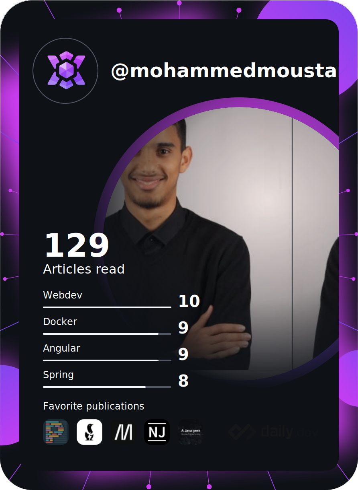

<h1 align="center">Hi 👋, I'm Mohammed</h1>
<h3 align="center">A Passionate Fullstack developer</h3>

# 💫 About Me:
I'm Mohamed Moustarhfir, a web developer with experience in front-end technologies such as HTML, CSS, Bootstrap, Tailwind CSS, and JavaScript. I also have experience with back-end technologies such as PHP, MVC, MySQL, and Laravel, as well as UI/UX tools such as Figma and Adobe XD. I am proficient in design tools such as UML and Agile methodologies such as Scrum. In addition, I am proficient in using Git, Github, REST API, and WordPress. 

## 🌐 Socials:
 

# 💻 Tech Stack:
                                  
# 📊 GitHub Stats:

  
  
  

## 🏆 GitHub Trophies

### ✍️ Dev Quote

---

